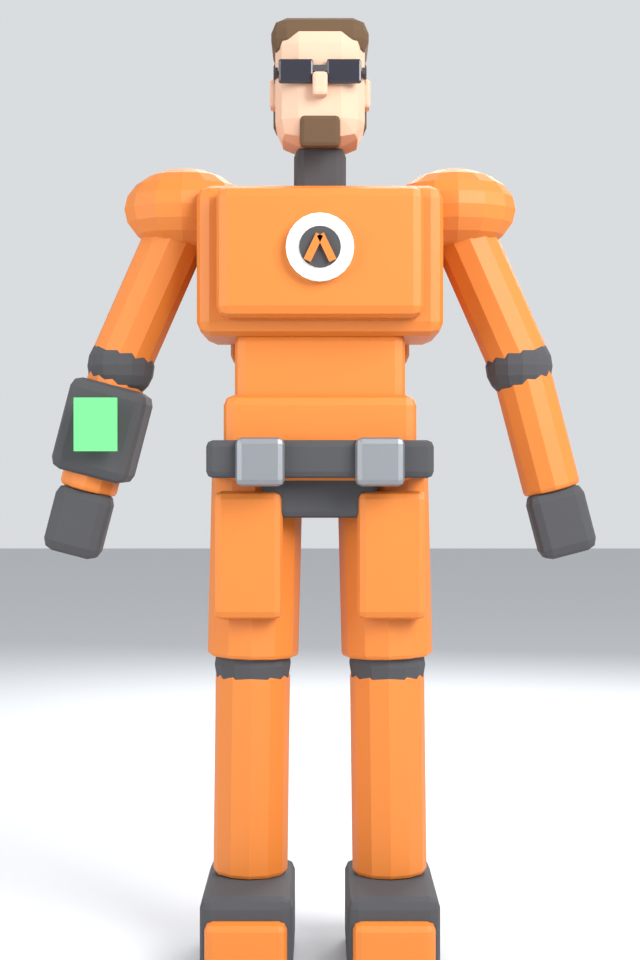
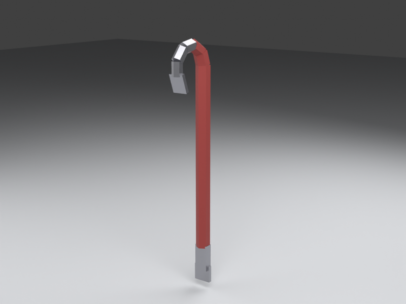
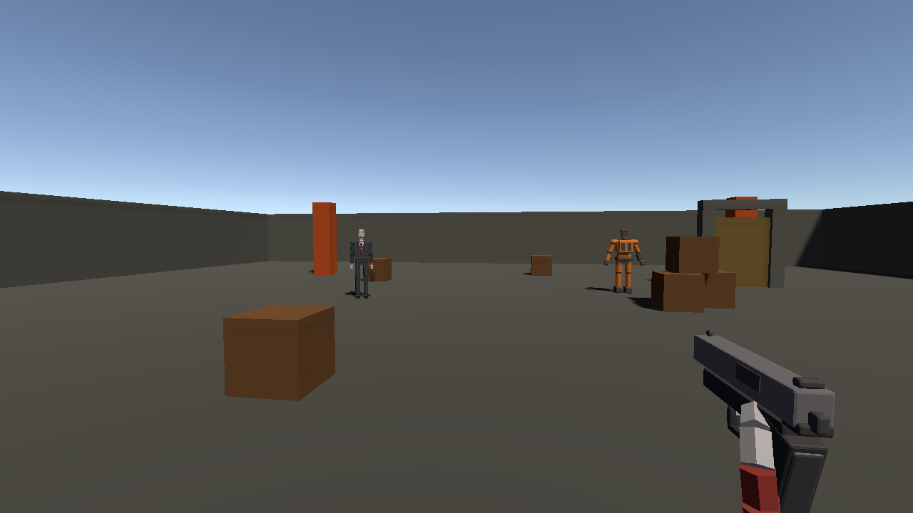

# Project G1

A retro FPS in the spirit of 1998 — original story, original world, built in Unity
with a fully scripted Blender asset pipeline. Hazard suits, humming laboratories,
a crowbar, and a man in a suit who is always watching.

| The scientist | The man in the suit | First tool of the trade |
|---|---|---|
|  |  |  |



## Current features

- **Two rigged characters** — protagonist (hazard suit) and villain (suit, briefcase,
  glowing eyes), each with looping Idle and Walk animations. Modeled, rigged, skinned,
  and animated entirely by Blender scripts in [`Tools/blender/`](Tools/blender).
- **Half-Life 1 movement physics** — real GoldSrc constants converted to meters:
  Quake-lineage ground/air acceleration, friction, air-strafing that gains speed,
  hold-to-bunnyhop.
- **Crowbar** — viewmodel with code-driven swing, movement bob, raycast impact,
  and breakable crates that shatter into physics shards.
- **9mm pistol** — fully animated (slide cycle, trigger, magazine reload) from a
  scripted 4-bone rig; clip + reserve ammo, hitscan damage, physics kick.
- **Combat core** — `IDamageable` / `HealthSystem` with events, debug world-space
  health bars over anything hurtable (one flag removes them completely).
- **+use interaction** — press E on the sliding door.
- **One-click test scene** — the entire scene is generated by an editor script
  (menu **G1 → Build Test Scene**), so nothing lives only in a scene file.

## Requirements

- **Unity 2022.3.62f3 LTS** (built-in render pipeline, classic Input Manager)
- **Blender 4.x/5.x** — only needed to regenerate or modify the 3D assets

> This repo began as an empty Unity 6 URP template and was retargeted to
> 2022.3 LTS + built-in RP for a simpler, retro-appropriate baseline.

## Getting started

1. Clone and open the project in Unity Hub with 2022.3 LTS (first import takes a few minutes).
2. Open `Assets/Scenes/TestScene.unity` and press **Play**.
3. If the scene is missing or broken, regenerate it: **G1 → Build Test Scene**.

### Controls

| Input | Action |
|---|---|
| WASD | Move (HL1 acceleration model) |
| Mouse | Look |
| Space (hold) | Jump / auto-bunnyhop |
| Left mouse | Attack (swing / fire) |
| R | Reload |
| 1 / 2 / scroll | Switch weapon (crowbar / pistol) |
| E | Use (doors, etc.) |
| Esc | Release mouse cursor |

## Project layout

```
Assets/
  G1/
    Models/       Protagonist.fbx, Villain.fbx, Crowbar.fbx (Blender exports)
    Scripts/      runtime gameplay code (movement, weapons, NPCs, interaction)
    Editor/       G1SceneBuilder (scene generator), G1Screenshot (headless captures)
    Anim/         generated AnimatorControllers
    Materials/    generated scene materials
  Scenes/         TestScene.unity (generated — safe to delete and rebuild)
Tools/
  blender/        the asset pipeline: model, rig, and animate everything from code
docs/             documentation (start here: docs/asset-pipeline.md)
```

## Documentation

- [Asset pipeline](docs/asset-pipeline.md) — how every model and animation is generated from Blender scripts
- [Player movement](docs/player-movement.md) — the HL1 physics model and how to tune it
- [Characters & animation](docs/characters-and-animation.md) — skeleton, skinning, clips, NPC driver
- [Weapons](docs/weapons.md) — crowbar, 9mm pistol, and how to add the next weapon
- [Combat & health](docs/combat-and-health.md) — IDamageable, HealthSystem events, debug health bars
- [Scene builder](docs/scene-builder.md) — what the generated test scene contains

## Roadmap

- Firearms: ~~9mm pistol~~ ✓ → SMG → shotgun (concept sheets already exist)
- Sound: footsteps, gunfire, swing/impact, ambience
- A real level to replace the test arena
- Story beats and scripted sequences
