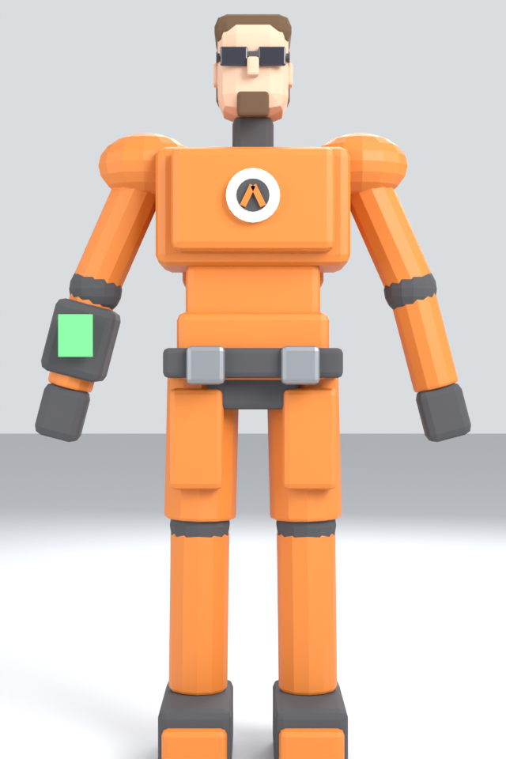
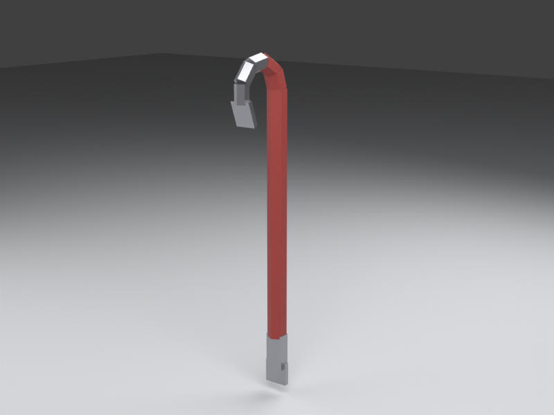
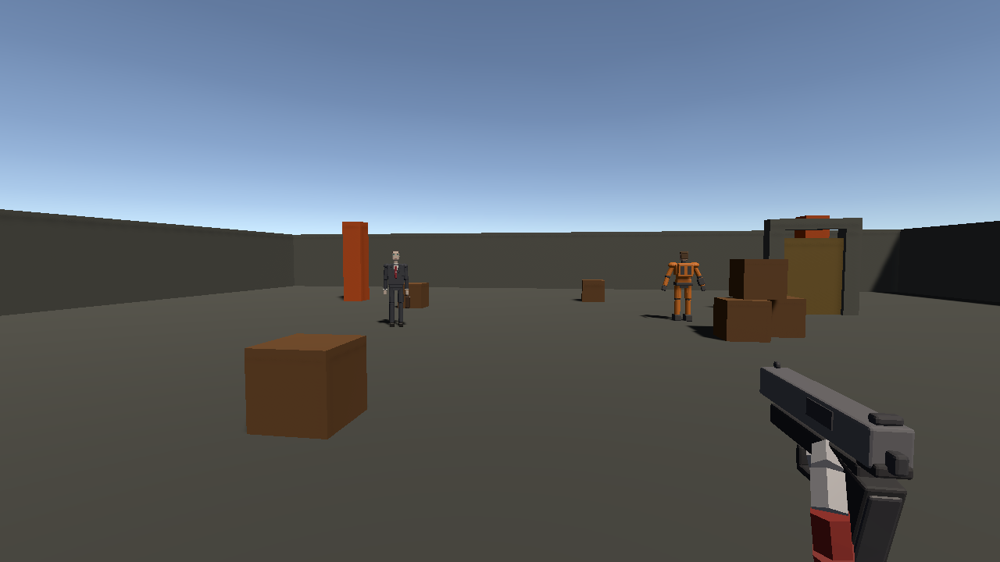

# Project G1

A retro FPS in the spirit of 1998 — original story, original world, built in Unity
with a fully scripted Blender asset pipeline. Hazard suits, humming laboratories,
a crowbar, and a man in a suit who is always watching.

| The scientist | The man in the suit | First tool of the trade |
|---|---|---|
|  |  |  |



## Story

You are a senior test engineer who survives the failure of an experiment meant to
hold open a doorway to *elsewhere*. But the Threshold is not a door to another
**place** — it is a door to every previous **time** the same disaster happened.
Project G1 is a **loop**. The "aliens" are the time-folded remains of everyone who
came before you. You survive every iteration because you are the **Anchor** — the
disaster cannot exist without you. And the man in the suit is not here to save you:
he audits the loop for a bureaucracy that **harvests catastrophes that never end**,
and he needs you to keep *almost* escaping, forever.

The game opens with a **skippable narrative cinematic** laying out the premise, and
ends on a real choice at the Threshold ring: **step through** (the loop resets — the
Auditor wins) or **turn your crowbar on the resonance emitters** (the loop collapses,
every trapped echo is freed, and the Anchor is unmade). The first weapon in the game
is the tool that ends it.

> Full lore lives in [docs/story.md](docs/story.md).

## Current features

- **The hazard suit** — the protagonist is built by `Tools/blender/build_character.py` to a grounded near-future industrial look rather than a primitive with a colour on it. Four things carry it: **layered construction** (a ribbed under-suit with hard shell plates bolted over it, so seams and edges exist to catch light); **material contrast** (matte rubber, brushed steel, worn webbing, tinted glass — silhouette reads at distance, materials read up close); a **sealed respirator helmet** with a visor band, filter canisters and a clipped-on headlamp, because a low-poly face is a box with a nose box on it and always looks like one; and an **asymmetric loadout** — wrist computer on one arm, plated bracer on the other, pouches placed unevenly, since perfect mirror symmetry is the tell of a model rather than of issued equipment.
  **Wear and grime reach the game**, not just the renders: `rig_character.py` UV-unwraps the joined mesh and bakes the node network to `Assets/G1/Textures/<Char>Dirt.png`. What it bakes is the dirt *mask*, not a finished albedo — baking the albedo would fuse hazard orange into the texture, and the builders tint each contact by faction, so a blue security tint over baked orange comes out mud. A white-to-grime mask multiplies cleanly against any tint, which is exactly what the Standard shader's `_MainTex * _Color` already does, so no custom shader is needed. `G1CharacterSkin` applies it, and fixes a quieter bug on the way: the builders assigned `renderer.sharedMaterial` (singular), which writes slot 0 and silently drops the other eleven, so only one material on the model was ever tinted.
  The mask itself comes off two signals that survive low-poly geometry: *occlusion* (a crevice is a crevice at any vertex count, so seams, strap undersides and plate joins darken) and *height* (you walk through it, so boots are filthy and the collar is nearly clean), broken up with noise and driving roughness as well as colour. Deliberately not `Geometry > Pointiness`, which is the obvious choice for edge wear and the wrong tool here — on a beveled cube almost every vertex is a corner, so whole flat panels register as "edge" and the suit bleaches to pale tan.
  The body itself is a stack of **elliptical, tapered rings** (`oval()`) rather than boxes — narrow at the hips, pinched at the waist, broad and flatter front-to-back at the chest — with the chest armour split into a centre panel and two side panels angled back around that curve. Round primitives are smooth-shaded across shallow angles only, so limbs stop reading as faceted pipes while hard edges stay hard. ~17k tris. Skeleton joint positions are unchanged from the original, so every existing animation still plays.
- **The Auditor** — built to the opposite brief from the hazard suit and sharing its construction: elliptical loft, smooth-shaded round forms, layered jacket over shirt and tie, and the only face in the game. He is handed `wear=0, grime=0` and stays immaculate while everyone else is filthy — a man who is never dirty in a place where everything is dirty is not from that place. Two arguments, and it is the cheapest characterisation in the project.
- **Campaign & Level Generation** — Complete 3-level campaign programmatically generated from modular Blender-scripted environment kits:
  - **Level 1 (Corvus Facility)**: Locker Room → Lab Corridor → Control Room → Industrial Hall (HECU ambush) → Alien Breach Zone → Emergency Elevator.
  - **Level 2 (Quarantine Zone)**: Outdoor industrial complex, toxic hazard zones, jump pads, and squad combat.
  - **Level 3 (Threshold Breach)**: Anomaly chamber, Xen portal breach, and multi-phase boss arena.
  - **Main Menu & Settings**: Retro UI with level select, volume controls, mouse sensitivity tuning, and FOV adjustments.
- **Half-Life 1 movement physics** — real GoldSrc constants converted to meters:
  Quake-lineage acceleration, friction, the authentic 30-ups air cap (strafe steering + bhop speed gain), hold-to-bunnyhop, coyote time, crouch.
- **Sprint on the suit's aux power** — hold `Shift` to run at 12.6 m/s instead of 8.1, drawing on an HEV auxiliary cell (`G1SuitPower`) that gives about eleven seconds of sprint and takes under four to recharge. Metered rather than free, so crossing open ground is a decision about whether you want the distance now or the escape later; the cell locks out when it bottoms out, the HUD bar reads amber while spending and pulses red while empty, wall chargers top it up once your armor is full, and the FOV stretch and footstep cadence follow the speed. Forward and standing only — no sprinting backwards out of a firefight.
- **Weapons & Equipment** — crowbar → pistol → shotgun → SMG → .357 magnum → cookable grenades. Found as spinning pickups. Every model is scripted in Blender with animated slides/bolts/cylinders; per-shell shotgun reload, revolver cylinder FSM with emergency chamber. Includes a toggleable **Flashlight** (`F`).
- **Aim down sights (hold RMB)** — the weapon comes up to the eye: FOV narrows to ~46°, bob and sway fade out, spread tightens to a third, and look sensitivity and walk speed drop to match the zoom. Driven from `WeaponBase` so all five weapons behave identically and a holstered one hands back everything it was scaling. Suppressed while sprinting — you cannot run and aim.
- **Secondary fire (middle mouse / `B`)** — pistol 3-round burst, shotgun double-barrel, SMG 40mm grenade launcher (draws from grenade reserve), crowbar charged heavy swing (2.5× + knockback). Moved off RMB when aim-down-sights took it. Grenades bounce with a full explosion (light flash, shockwave ring, debris) and cooking feedback.
- **Drivable trucks** — an 800m map is a lot of walking and sprint only buys seven seconds of it, so **24 trucks** are parked at every district and on both ring roads, so from anywhere on the map there is one within roughly 80m — close enough that driving is a choice rather than a lucky find. They stop at walls (a kinematic body moved by transform assignment collides with nothing, so the move is swept first and velocity into the surface is removed, letting it slide along rather than stick) and **run people over** — momentum is the weapon, so damage scales with speed and is lethal at anything like a road speed. Soldiers deliberately do not block the sweep: a person should go under a truck, not stop it dead. Walk within 5m and an **[E] DRIVE** prompt appears; you do not have to aim at it, though aiming still works, and a truck will not steal an `E` meant for the person standing beside it. The nearest three show as markers on the scanner HUD. `E` to get in, WASD to drive at about three times running speed, `E` to get out; headlights come on while you are driving and the engine note tracks your speed. Deliberately arcade rather than WheelColliders — wheel physics needs friction curves, suspension and a centre of mass that all have to be right together or it flips on the first kerb, and none of that is visible to someone crossing a battlefield. Forces along the body plus a ground raycast stay predictable on terrain with this many ramps and berms. The trade is that a truck is a large loud target that cannot use cover.
- **HEV armor** — HL-style armor pool absorbs 80% of incoming damage; AP meter on the HUD; battery pickups and wall chargers (`E`) across the campaign.
- **Pickups & Progression** — Health/armor/ammo packs, story lore cards, checkpoints, and a cross-session **save/Continue** (JSON in persistentDataPath).
- **Bosses** — Level 2 HECU gunship: strafing machine-gun runs, 3-rocket salvos, destructible rotor health.
- **A main storyline, in nine chapters** — the Sprawl used to be a battlefield with errands scattered on it. `G1StoryDirector` gives it a spine: PROLOGUE (the gate) → WHAT IS LEFT OF FORTY-ONE → THE LIVING → WHAT IS IN THE SKY → GROUND → DEAD AIR → TWO HUNDRED AND SIX → WHAT HE IS SAYING → FINALE (the Threshold). Crucially it doesn't add a parallel quest line: the contacts already introduce each other in a fixed order and their assignments already escalate, so each chapter simply watches an objective that already exists, puts a title card up when it opens, and has somebody speak when it closes. The finale is new — a Threshold ring in the southern ruins held open by three resonance emitters, and the last objective in the game is to break them.
- **Voices — the cast says the actual words** — nobody recorded a line and nobody needs to. `Tools/audio/generate_voice.py` walks the C# that *defines* the script, hands each line to eSpeak NG with that character's voice settings, and writes one clip per line; `G1Voice` finds the right recording at runtime by hashing the text it is about to say. That means the C# stays the single source of truth for the script — there is no second copy to drift — and rewording a line mints a new clip rather than quietly keeping the old audio over the new words. The dialogue typewriter paces itself to the clip's length, so the text lands exactly as the line finishes instead of reading like bad dubbing. Ten voices: a chief who barks low and level, a quartermaster lower still, a signals tech at 3.4 words a second, a research lead, a medic, an engineer, the flat too-even suit V.I., the Auditor's unbothered drawl, you — and the Echo, a croak at 1.6 words a second, every word dragged out of a body that stopped being theirs. Lines with no recording yet fall back to blipping six formant-synthesized vowels in time with the typewriter, so an unvoiced line sounds like someone talking too fast to hear rather than like a bug.
- **Quest contacts & the bio-scanner** — seven survivors of the Corvus Sprawl hand out side work: an engineer, a medic, a security chief, a research lead, a signals tech, a quartermaster, and an Echo of someone the loop already ate. Finding them is the mechanic: `Q` fires a scan pulse that sweeps a 150m radius and logs any contact inside it — and reports the bearing of the nearest unknown bio-signal when it finds nobody, so you always have a lead. Known contacts ride a compass strip and wear a glyph you can read from across the map (`!` has work, `·` in progress, `?` report back, `✓` done); `J` opens the contact log. Accepting a brief (`E`/`X`) registers the objective, drops a waypoint on the work, and sends you back for a reward — and each contact introduces the next, so the chain pulls you across all six districts.
- **The Corvus Sprawl — an 800×800m base you can go inside** — the battlefield map is Blender-scripted from `Tools/blender/build_huge_map.py`. Version one was 600m of *solid* blocks: every building was a boulder you walked around. Half-Life's spaces are the opposite, so the buildings are hollow now — doorways cut as real gaps between wall segments, floors, upper storeys, window bands, ramps to rooftops and catwalks between them. Fifty interiors, forty-seven verified walkable, each lit and a third of them stocked. The extra 200m of footprint is spent on what a real base has and a block of concrete doesn't: a 280m **runway** with aircraft revetments, a three-storey control tower and two hangars; six earth-bermed **ammo igloos** dispersed along their own service road; a zigzag **trench line** with pillboxes and hedgehog obstacles guarding the southern approach; a **tank park** of revetments behind an enterable workshop; and T-wall blast barriers, Hesco runs, floodlight masts, guard posts and climbable watchtowers throughout — all placed to break a 400m sightline into a series of 40m ones. A water tower and a radar array give the far corners silhouettes you can navigate by.
- **Interiors that sound like interiors** — stepping through a doorway changes the mix, not just the view. `G1InteriorSpace` reads the room list from the map manifest (so it knows the actual boxes rather than raycasting for a ceiling that a catwalk would fake), and blends reverb, a low-pass on everything outside, ambience level, fog distance and ambient light as you cross the threshold. The reverb tail is driven by the room's real floor size, so a 46m workshop rings for two and a half seconds and a 4m sentry box goes dead and close. Footsteps go louder and duller on a concrete floor.
- **Cover the AI can actually use** — the trenches, pillboxes, sandbag lines and tower parapets were scenery: `G1FactionFighter` walked to its engage range and stood in the open. The map generator now emits firing positions from the barrier geometry itself and ships them in the manifest — behind sandbag lines, on trench fire steps, at pillbox slits, behind parapets — and ranged fighters close the distance first, then dig in, re-testing their spot as the threat moves and abandoning it once flanked. Three pieces of the map were rebuilt to make this true rather than nominal: trenches gained a **fire step** (a 1.9m-walled ditch is a corridor you cannot shoot out of), pillbox slits dropped to chest height, and tower parapets came down below standing eyeline. Positions that end up buried or off the navmesh are pruned after the bake, because a fighter that claims an unreachable point walks at it for the rest of the fight and never fires.
- **Grime and clutter** — oil under the vehicle bays, tyre tracks across the aprons, rubber on the runway, scorch where the map's own story says fighting happened, painted bay lines and a helipad cross; barrels, pallet stacks, crates and cable spools clustered wherever people work. Flat-shaded boxes a few centimetres proud of the floor rather than decal shaders, which is what the rest of the pipeline is — twelve triangles each, and they do more for how the ground reads than any amount of extra architecture.
- **Map manifest pipeline** — the FBX is geometry and nothing else, so the generator also writes `HugeMap.manifest.json` listing every interior it built. `G1MapManifest` reads it back to place interior lights, floodlights and supply caches, instead of the same fifty coordinates being typed on both sides and drifting the first time a wall moves. The map exports as sixteen district-sized chunks plus a shell object for the roads and perimeter: one merged mesh meant a single light budget for the whole map (so every interior lamp got dropped) and a bounding box that was never frustum-culled.
- **Self-correcting placement** — hand-authored coordinates get probed against the merged map meshes before anything is spawned (`G1Placement`). Contacts that would stand inside a sealed block or on a rooftop are walked out to the nearest reachable ground, bunkers slide off buildings, and a structure whose only door opened into a wall turns to face walkable ground. The south gate does the same for itself: it raycasts the approach and shifts along the road until its doorway has an 8m clear corridor, because the FBX parks a guard mast on the centre line. Verified headlessly by `G1VerifyBuild` (`Temp/g1_verify`) and in Play mode by `G1SelfTest` (`Temp/g1_playtest_arm`), which report every relocation.
- **Doors, bunkers & the opening beat** — the Sprawl is walled now. **SGT. KANE** waits at a sealed south gate with the first mission; accepting it sounds the alarm, grinds the twin blast doors apart and wakes the HECU picket dug in behind them, so combat starts on your word rather than on a timer. `G1BlastDoor` is a heavy two-panel door that can be sealed, with a status lamp that reads red/amber/green from across the plaza; four stocked bunkers and walled compounds around the comms array and the northeast warehouse turn quest destinations into doors you have to open. `PlayerUse` now aims with a ray, then a spherecast, then a line-of-sight cone sweep, so `E` lands on people and panels instead of demanding pixel-perfect aim.
- **Enemies & AI** — zombies and aliens with separation steering, HECU soldiers running a GOAP-lite planner (cover claims, squad roles, flanks, opportunist alpha strikes), all paced by an L4D2-style ThreatDirector with horde events. Features interactive CCTV monitoring screens and narrative G-Man cameos.
- **Procedural Audio & Music** — Synthesized retro SFX generated from pure math (guns, impacts, doors, pickups, footsteps, horde roars), dynamic background ambience, and tension music tracks without external audio files.
- **Combat core** — `IDamageable` / `HealthSystem` events, breakables, damage vignette + hit markers, world-space debug health bars, death → fade → checkpoint respawn.
- **Retro HUD** — GoldSrc-amber health/ammo in Share Tech Mono, low-health pulse, weapon pickup flash, story cards, green crosshair.
- **Flyable helicopters** — three, on the allied helipad, the airstrip apron and the plaza: the three places you most want to leave from. `E` to board, `W/S` collective, `A/D` yaw, arrow keys cyclic, `Shift` for throttle. Arcade like the trucks and for the same reason, but with the two things a car does not do — you **tilt in the direction you travel**, which is the whole illusion of flight, and you **keep travelling after you stop asking to**, because nothing but drag stops three tonnes moving through air. Getting out mid-air is refused *audibly*, because a control that silently does nothing reads as broken rather than as a rule. Altitude is capped and the map perimeter enforced, so the Sprawl stays the place the game happens in.
- **Elevators** — `G1Elevator` is a two-stop lift: stand on the deck, press `E`, ride. Four of them, on high ground the map already had but barely served — warehouse and hangar roofs, the lab upper floor, and the command tower, whose roof has held the Auditor and no way up since the map was built. The rider is moved by an explicit `Move()` delta rather than by parenting, because a CharacterController parented to a moving transform fights its own depenetration and jitters.
- **Dusk and dust** — the map used to sit under flat midday overcast, which is the one condition with no shape to it: every surface takes the same grey and the place reads as a diagram. The sun is now low and amber with the ambient fill pushed blue, so shadow and light differ in *hue* and not only in value — long raking shadows across 800m of open ground and a horizon you can navigate by. The sky is a **captured HDRI** (`freight_station_2k.hdr`, CC0 from Poly Haven) — the one downloaded file in an otherwise generated repo, and it earns its place: a real sky does not just look better behind the geometry, it *lights* the scene, so a surface facing the sunset picks up its orange and one facing away picks up the cold half of the sky. Ambient intensity is held low (0.38) on purpose — a bright sunset flooding every surface evenly is the same flatness as midday overcast, just warmer, so the directional sun stays the thing that makes the shape. `G1TextureImport` sets HDRIs to Texture Shape: Cube on import, because an equirectangular map imported as a flat 2D texture renders as a smear and that one checkbox is exactly the kind of manual step that gets forgotten. The build falls back to a procedural haze if the file is absent. Fog is browner and closer, fog is browner and closer, and interior lamps went sodium-warm and brighter to earn their keep against it. Every non-emissive material on the map is coated toward an ochre grey at creation, which pulls the whole palette down to something weathered while leaving the hues in their relative places, so the districts still tell each other apart. Lights, screens and beacons are exempt — they are the things that are supposed to cut through the murk.
- **Colour per district** — the palette was three greys, an orange and an olive, so districts were told apart by shape alone, which at 800m through fog is not enough. The labs are teal, the aid post white with a red cross, the fuel depot yellow, the comms hut signal-green, the quarters brick, the airstrip cold grey, with hazard chevrons on the lab line and red beacons on the masts and the command tower.
- **God Mode carries the ammo too** (`G`) — being unkillable but still walking back to a crate every thirty seconds is the worst of both: no tension and no freedom, so the two resources travel together. `G1GodModeAmmo` keeps the clip and reserve full while god mode is on (the clip too, so a weapon never drops into a reload mid-burst) **and unlocks every weapon slot** — topping up ammo for a gun you cannot select is not infinite ammo for every weapon, it is infinite ammo for the two you happened to find, the HUD swaps the reserve count for an infinity glyph in green, and switching god mode off hands the economy straight back.
- **Sandbox & Testing Range** — Complete testing sandbox with always-on ammunition (`G1InfiniteAmmoSandbox`, which just pins the above to always-on), God Mode invincibility (`G`), 3D Fly/Noclip Mode (`V`), and an interactive **Mob Spawner Toolbox** (`TAB`) for dynamically spawning Zombies, HECU Soldiers, Aliens, Hordes, Squads, and Bosses with a "Kill All" cleanup utility.
- **Observability tooling** — F3 telemetry HUD, soldier AI state gizmos, seeded arena presets for reproducible AI testing.
- **Everything is procedural** — scenes, models, animations, audio, navmesh: all generated from code in the repo, nothing hand-placed.

## Requirements

- **Unity 2022.3.62f3 LTS** (built-in render pipeline, classic Input Manager)
- **Git LFS** — model binaries (`*.fbx`) are LFS-tracked. Run `git lfs install`
  once before cloning/pulling, or every model imports as an empty 131-byte
  pointer file and the scene builder fails with
  `InvalidOperationException: Sequence contains no matching element`.
- **Blender 4.x/5.x** — only needed to regenerate or modify the 3D assets
- **eSpeak NG** — only needed to re-speak the dialogue after editing it
  (`brew install espeak-ng`, or `apt install espeak-ng`). The generated `.wav`
  files are committed, so playing and building the game needs neither this nor
  Blender. Re-run `python3 Tools/audio/generate_voice.py` after changing any
  line in `G1QuestNpcBuilder`, `G1DoorKitBuilder` or `G1StoryBuilder`.

> This repo began as an empty Unity 6 URP template and was retargeted to
> 2022.3 LTS + built-in RP for a simpler, retro-appropriate baseline.

## Getting started

1. Clone and open the project in Unity Hub with 2022.3 LTS (first import takes a few minutes).
2. Open `Assets/Scenes/TestScene.unity` or `Assets/Scenes/MainMenu.unity` and press **Play**.
3. Rebuild levels anytime via the top editor menu:
   - **G1 → Build Main Menu**
   - **G1 → Build Test Scene** (Level 1)
   - **G1 → Build Level 2 (Quarantine)**
   - **G1 → Build Level 3 (Threshold)**
   - **G1 → Build Weapon Testing Range** (Sandbox range with mob spawner & infinite ammo)
   - **G1 → Rebuild Arena / [Preset]** (AI testing sandboxes)

### Controls

| Input | Action |
|---|---|
| WASD | Move (HL1 acceleration model) |
| Mouse | Look |
| Space (hold) | Jump / auto-bunnyhop (Up in Fly mode) |
| Ctrl or C | Crouch (Down in Fly mode) |
| Shift (hold) | Sprint — drains the HEV aux cell (Fast fly mode while flying) |
| Left mouse | Attack (swing / fire / cook grenade) |
| Right mouse (hold) | Aim down sights — narrows FOV, tightens spread, slows you down |
| Middle mouse / B | Secondary fire (burst / double-barrel / launcher / heavy swing) |
| R | Reload |
| 1–6 / scroll | Switch weapon (unlocked slots only; 6 = Grenade) |
| F | Toggle Flashlight |
| E | Use (doors, terminals, **get in / out of a truck**) |
| WASD (driving) | Steer and accelerate |
| W/S · A/D · arrows (flying) | Collective · yaw · cyclic pitch and roll |
| G | Toggle God Mode (invincibility **and** unlimited ammunition) |
| V | Toggle 3D Fly Mode (Flight / Noclip) |
| TAB | Toggle Mob Spawner Toolbox |
| F3 | Toggle AI telemetry overlay |
| Esc | Release mouse cursor / Open pause settings menu |

## Project layout

```
Assets/
  G1/
    Models/       Protagonist.fbx, Villain.fbx, Crowbar.fbx, Gun FBXs (Blender exports)
    Scripts/      runtime gameplay code (movement, weapons, NPCs, checkpoints, pickups, UI)
    Editor/       G1SceneBuilder, G1CampaignBuilders, G1MenuBuilder, G1Screenshot
    Anim/         generated AnimatorControllers
    Materials/    generated scene materials
  Scenes/         MainMenu.unity, TestScene.unity, etc. (generated — safe to delete and rebuild)
Tools/
  blender/        the asset pipeline: model, rig, and animate everything from code
docs/             documentation (start here: docs/asset-pipeline.md)
```

## Documentation

- [Asset pipeline](docs/asset-pipeline.md) — how every model and animation is generated from Blender scripts
- [Player movement](docs/player-movement.md) — the HL1 physics model and how to tune it
- [Characters & animation](docs/characters-and-animation.md) — skeleton, skinning, clips, NPC driver
- [Weapons](docs/weapons.md) — crowbar, 9mm pistol, shotgun, SMG, magnum, grenades
- [Combat & health](docs/combat-and-health.md) — IDamageable, HealthSystem events, health bars, death/respawn
- [Audio](docs/audio.md) — the procedural SFX pipeline, footsteps, ambience, and G1Audio API
- [Observability](docs/observability.md) — F3 telemetry HUD, soldier AI gizmos, seeded arena presets
- [Scene builder](docs/scene-builder.md) — how levels are generated from code
- [Story bible](docs/story.md) — the Corvus Annex, the Threshold event, chapters, characters
- [Architecture](docs/architecture.md) — full technical spec
- [Art bible](docs/art_bible.md) — art direction and asset list

## Roadmap

- ~~Firearms (pistol, SMG, shotgun, magnum)~~ ✓ · ~~Audio & footsteps~~ ✓ · ~~Death/respawn~~ ✓
- ~~Health & ammo pickups, grenades, flashlight~~ ✓
- ~~Checkpoints, main menu, settings (sensitivity/FOV/volume)~~ ✓
- ~~Ambience + music soundscapes~~ ✓
- ~~Level 1 (Corvus Annex) → Level 2 (Quarantine Zone) → Level 3 (Threshold Boss Arena)~~ ✓
- ~~Skippable opening story cinematic + branching finale (Stabilize / Collapse the loop)~~ ✓
- ~~Loop-lore layer: iteration graffiti, degrading Sweeper radio, one-word Taken echoes~~ ✓
- Save/load game state serialization to disk
- Secondary fire modes for firearms (SMG grenade launcher, shotgun double-barrel)
- Advanced multi-phase alien boss mechanics in Level 3
- Modding and custom procedural level seed export/import support

