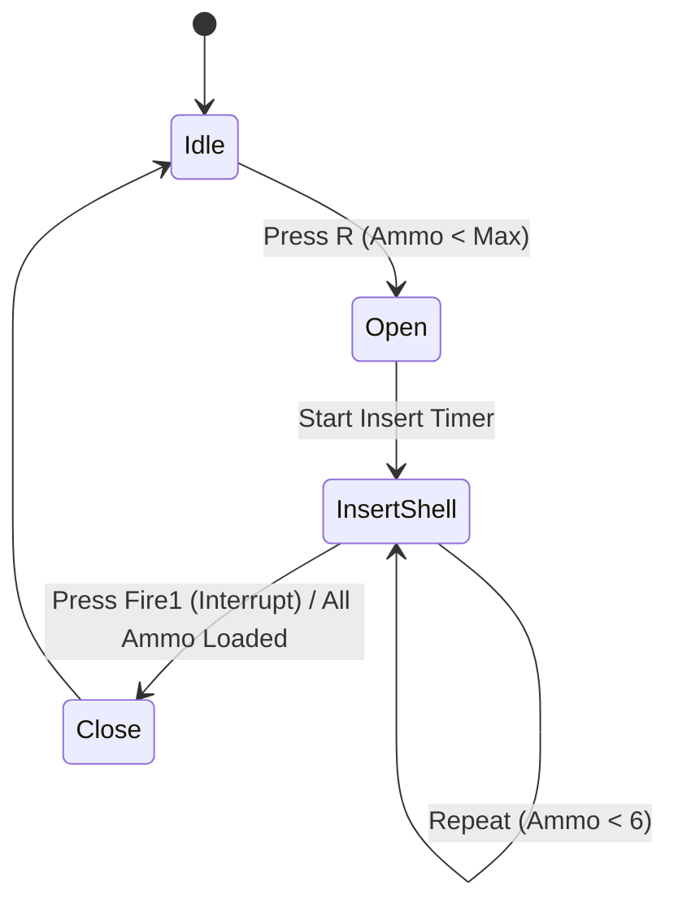

# Project G1 — Core Architecture & Mechanics Documentation

This document provides a production-grade, detailed breakdown of all core mechanics, state machines, math formulas, and AI systems in Project G1.

---

## 1. Player Physics & Movement

### 1.1 Bunnyhopping (Quake/GoldSrc Style)
Movement utilizes a custom acceleration model that bypasses standard ground friction when jumping, allowing momentum to stack:
* **Air Acceleration Math**:
  When in the air, the player's velocity projection is checked against the input direction. If the projection is below the max speed limit, acceleration is applied:
  \[
  \text{projVel} = \vec{v}_{\text{current}} \cdot \vec{u}_{\text{inputDir}}
  \]
  \[
  \text{addSpeed} = \text{maxAirSpeed} - \text{projVel}
  \]
  If \(\text{addSpeed} > 0\), air acceleration is capped and added:
  \[
  \vec{v}_{\text{new}} = \vec{v}_{\text{current}} + \text{addSpeed} \times \text{airAcceleration} \times \Delta t \times \vec{u}_{\text{inputDir}}
  \]
* **Coyote Time**:
  A `0.12-second` window is maintained. If the player runs off a ledge without jumping, they can still trigger a jump within this duration, improving game feel.
* **Speed FOV Expansion**:
  The camera's FOV expands dynamically based on horizontal speed. Velocity magnitude above the run speed threshold adds up to `+8 degrees` to the base FOV:
  \[
  \text{FOV}_{\text{target}} = \text{BaseFOV} + \text{Mathf.Clamp}(\text{speedRatio} \times 8.0^\circ, 0^\circ, 8^\circ)
  \]

---

## 2. Weapon Systems & FSMs

All weapons conform to a **zero-runtime-allocation contract**, utilizing `RaycastNonAlloc` and pre-allocated buffers to prevent Garbage Collection spikes.

### 2.1 Aim Assist (Bullet Magnetism)
* **Cone Check**: A `2-degree` cone angle is calculated around the player's reticle direction.
* **Closest Point Projection**: If a target's collider falls within the magnetism cone, the firing raycast is subtly bent toward:
  ```csharp
  Vector3 targetPoint = targetCollider.ClosestPoint(raycastOrigin);
  ```
  This adjusts the bullet trajectory to help players hit close-range targets without active snapping.

### 2.2 Magnum .357 Cylinder FSM
The Magnum uses a cylinder reloading state machine to support shell-by-shell interruptible loading:

* **Interruptible reload**: Pressing the fire button at any point during `InsertShell` immediately cancels the sequence, transitioning to `Close` and letting the player fire whatever shells are currently loaded.

### 2.3 Shotgun Shell-by-Shell FSM
Similar to the Magnum, the 12-gauge shotgun supports shell-by-shell reloading:
* Spawns 8 pellet rays in a random spread cone on fire.
* The reload loop inserts shells one at a time, each incrementing reserve ammo and updating HUD. Firing at any point cancels the reload loop instantly.

### 2.4 Additive Camera Recoil
Recoil stacks additively on rapid fire and decays exponentially:
* **Recoil Accumulator**:
  ```csharp
  _recoilAccum = Mathf.Min(_recoilAccum + 6.0f, 9.0f); // cap at 9 degrees max
  ```
* **Exponential Decay**:
  Decayed inside `Update()` or `LateUpdate()` using:
  ```csharp
  _recoilAccum = Mathf.Lerp(_recoilAccum, 0f, Time.deltaTime * 8.5f);
  ```

---

## 3. Threat Director & Horde Events

### 3.1 Pacing & Intensity
The `ThreatDirector` calculates threat intensity based on:
- Damage taken by player.
- Player kills.
- Proximity of enemies.
- Decays passively by `0.08` per second during the `Relax` state.

### 3.2 Horde Events (L4D2 Style)
When intensity crosses `0.75` during the `Peak` state:
1. Triggers warning roar logs.
2. Stagger-spawns 8-12 horde mobs (50% Zombies, 50% Neon Purple Aliens).
3. Spawned mobs receive a `1.35x` movement speed boost.
4. Uses frustum culling: spawn positions are checked against the player camera's viewport coordinates to ensure they spawn out of direct line-of-sight.

### 3.3 Separation Steering (Boids-lite)
To prevent horde enemies from forming single-file queues ("conga lines"), they apply a separation vector:
1. Conducts a `Physics.OverlapSphereNonAlloc` query against the `Enemy` layer in a `1.5m` radius.
2. Accumulates vectors pointing away from nearby allies:
   ```csharp
   Vector3 separationForce = Vector3.zero;
   for (int i = 0; i < count; i++) {
       Vector3 diff = transform.position - nearby[i].transform.position;
       separationForce += diff.normalized / Mathf.Max(diff.magnitude, 0.1f);
   }
   ```
3. Blends this separation force into the `NavMeshAgent` steering direction.

---

## 4. HECU GOAP-lite Squad AI

HECU Soldiers coordinate combat actions dynamically through a lightweight Goal-Oriented Action Planning (GOAP) loop.

### 4.1 Squad Blackboard Roles
The squad blackboard registers role claims to coordinate actions:
* **Suppress**: Keeps the player pinned down.
* **FlankLeft / FlankRight**: Moves to positions perpendicular to the player-to-soldier vector.

### 4.2 Cover Point Validation & Caching
* **Placement**: Cover points are spawned offset by `size * 0.5f + 0.6f` around slabs $> 0.8\text{m}$ high.
* **Validation Caching**:
  Linecasts checking if a cover point is shielded from the player are cached:
  ```csharp
  // Cache expires after 0.25 seconds or if the player moves more than 1 meter
  bool isExpired = (Time.time - lastCheckTime > 0.25f) || (Vector3.Distance(playerPos, lastCheckedPlayerPos) > 1f);
  ```

### 4.3 Opportunistic Predator Layer
Provides coordinated tactical ambush logic:
```
                       [Overwhelmed Mode (Mobs >= 2)]
                                     │
                                     ▼
                        HECU walks quietly to cover
                        crouches (height -> 1.0m)
                                     │
                                     ▼
                       [Player HP drops below 50%]
                                     │
                                     ▼
                        Squad triggers Alpha Strike
                         HECU stands up (1.8m)
                             Coord fire!
```
* **Ducking Collision**:
  Entering cover shrinks the capsule collider height to `1.0m` and center to `0.5m`, physically shielding the soldier from projectiles. Firing resets heights to `1.8m`.
* **Alpha Strike Broadcast**:
  A timestamp broadcast ensures all registered opportunists react and stand up to fire at the same frame, executing a synchronized death volley.

---

## 5. Observability & Dev Telemetry

### 5.1 F3 Debug HUD
Renders via `OnGUI()` when pressing F3:
- Live proximity mob count.
- Player Health percentage.
- Registered opportunists count.
- Last Alpha Strike timestamp delta.

### 5.2 AIDebugGizmos (Editor Only)
Overhead UI in editor scene view:
- **Wire Spheres**: State representation (Yellow = PopFire, Cyan = MoveToCover, Orange = Suppress, Magenta = Flank, Blue = Reload, Grey = Retreat, Red = Opportunist).
- **Labels**: Displays current `Action | SquadRole`.
- **Target Lines**: Green line to claimed cover point, Red line to player target.

---

## 6. Procedural Arena Presets

Preset generation seeds `System.Random` to ensure reproducible level layout:

| Preset | Seed | HECU | Zombies | Aliens | Cover Blocks |
|---|---|---|---|---|---|
| **Standard** | 1337 | 1 | 1 | 1 | 8 |
| **Solo HECU** | 101 | 1 | 0 | 0 | 8 |
| **Horde Overwhelm** | 666 | 2 | 3 | 3 | 10 |
| **Low Cover** | 42 | 2 | 1 | 1 | 2 |
